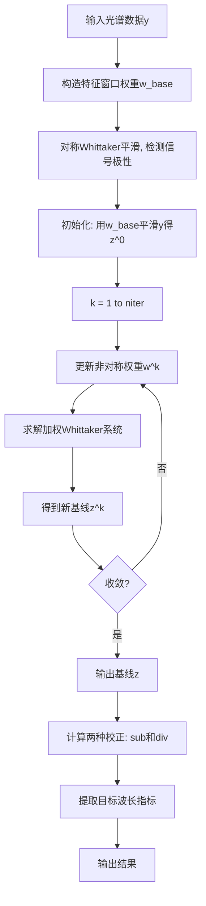

# 基线去除与特征提取系统

## 目录

1. [概述](#概述)
2. [理论基础](#理论基础)
   - [Whittaker平滑器](#whittaker平滑器)
   - [非对称最小二乘法（AsLS/AsLSS）](#非对称最小二乘法aslsaslss)
   - [两种校正定义](#两种校正定义)
3. [算法原理详解](#算法原理详解)
4. [操作步骤](#操作步骤)
5. [代码逻辑](#代码逻辑)
6. [参数选择指南](#参数选择指南)
7. [应用示例](#应用示例)
8. [常见问题](#常见问题)

---

## 概述

本项目实现了基于 **Eilers & Boelens** 经典论文的 **AsLSS（Asymmetric Least Squares Smoothing）** 算法，用于光谱基线估计和去除。该方法特别适合处理：

- **红外（IR）反射率光谱**：含有吸收峰的基线校正
- **透射光谱**：透射率的背景去除
- **吸光度光谱**：涨落背景的平滑与去除
- **任何含有趋势性背景的信号**：如拉曼光谱、荧光光谱等

### 核心优势

| 特性 | 优势 |
|------|------|
| **自动基线跟踪** | 基线沿信号谷底走，不会被峰值"拉起" |
| **参数少** | 仅需调整λ（平滑度）、p（非对称度）、niter（迭代数） |
| **计算高效** | 使用稀疏矩阵技术，O(m)复杂度 |
| **数值稳定** | 适应宽范围的信号强度和噪声水平 |
| **特征保护** | 支持特征窗口加权，防止基线被特征吸引 |

### 应用背景

在光谱测量中，原始信号通常含有：
- **系统背景**：仪器和样品的底层响应（缓慢变化）
- **分析特征**：样品的特征峰（快速变化）

基线去除的目标是：
1. **估计系统背景**（基线）
2. **移除背景**，突出特征
3. **定量特征**：计算峰値、面积、位置等

---

## 理论基础

### Whittaker平滑器

#### 问题定义

给定噪声测量信号 $y = (y_1, y_2, \ldots, y_m)^T$，寻找平滑信号 $z = (z_1, z_2, \ldots, z_m)^T$ 使得：

$$\min_z \sum_{i=1}^{m} w_i(y_i - z_i)^2 + \lambda \sum_{k=1}^{m-2} (\Delta^2 z_k)^2$$

其中：
- $w_i$：第i个点的权重（通常为1或根据测量误差选择）
- $\lambda$：**平滑参数**，控制平滑强度
- $\Delta^2 z_k = z_k - 2z_{k+1} + z_{k+2}$：**二阶差分**（离散二阶导数）
- 目标函数的第1项：**数据拟合项**（将z接近y）
- 目标函数的第2项：**平滑约束**（鼓励z为光滑曲线）

#### 矩阵形式

令 $D$ 为（$m-2 \times m$）的**二阶差分矩阵**：

$$D = \begin{pmatrix}
1 & -2 & 1 & 0 & \cdots & 0 \\
0 & 1 & -2 & 1 & \cdots & 0 \\
\vdots & \vdots & \vdots & \vdots & \ddots & \vdots \\
0 & \cdots & 0 & 1 & -2 & 1
\end{pmatrix}$$

目标函数可写为：

$$S(z) = (y - z)^T W (y - z) + \lambda z^T D^T D z$$

其中 $W = \text{diag}(w_1, w_2, \ldots, w_m)$ 是对角权重矩阵。

#### 闭式解

对 $z$ 求偏导并令其为0：

$$\frac{\partial S}{\partial z} = -2W(y - z) + 2\lambda D^T D z = 0$$

整理得**法线方程**（Normal Equation）：

$$(W + \lambda D^T D) z = W y$$

这是一个稀疏线性系统，其中系统矩阵 $(W + \lambda D^T D)$ 为五对角对称矩阵（SPD），可高效求解。

#### 平滑参数λ的作用

最优解 $z^*$ 满足：

$$z^* = (W + \lambda D^T D)^{-1} W y$$

- **λ = 0**：无约束，$z^* = W^{-1}W y = y$（完全拟合数据）
- **λ 很小**：$z^*$ 接近 $y$，保留噪声
- **λ 很大**：$(W + \lambda D^T D) \approx \lambda D^T D$，$z^*$ 接近线性函数或常数

经验值的选择通常需要 **参数网格搜索**：尝试 $\lambda \in \{10^2, 10^3, \ldots, 10^9\}$ 并目视评估。

### 非对称最小二乘法（AsLS/AsLSS）

#### 问题：标准Whittaker的局限

标准Whittaker平滑（$w_i = 1$）对所有点等权，导致问题：

考虑反射率光谱，基线应沿着信号的"谷底"：
```
反射率
 |     /\
 |    /  \     <- 峰值（吸收）
 |   /    \
 |__/______\___ <- 基线应该这样走
```

但如果用等权重Whittaker，基线会被峰值"拉起"：
```
反射率
 |     /\
 |    /  \
 | _-/____\-_  <- 基线被拉起了！（不理想）
```

#### 解决方案：非对称权重函数

AsLS的关键思想：在权重中引入 **非对称性** $p$，使得：

- **在峰值处**（$y_i > z_i$）：权重 = $p$（较小，$p \ll 0.5$）
- **在基线处**（$y_i < z_i$）：权重 = $1-p$（较大，$1-p > 0.5$）

这样的权重分配鼓励基线沿着信号的下界走。

#### 迭代算法（EM风格）

AsLS是一个 **迭代算法**：

**初始化**（$k=0$）：
$$z^{(0)} = \arg\min_z \sum w_i^{base}(y_i - z_i)^2 + \lambda(D z)^T(D z)$$
用基础权重 $w_i^{base}$ 进行标准Whittaker平滑。

**迭代**（$k = 1, 2, \ldots, n_{iter}$）：

1. **更新权重**：根据上一步的基线 $z^{(k-1)}$ 计算当前残差：
   $$w_i^{(k)} = w_i^{base} \left[ p \cdot \mathbb{1}(y_i > z_i^{(k-1)}) + (1-p) \cdot \mathbb{1}(y_i < z_i^{(k-1)}) \right]$$
   其中 $\mathbb{1}(\cdot)$ 为示性函数（条件真时=1，假时=0）

2. **拟合基线**：用更新的权重求解Whittaker平滑：
   $$(W^{(k)} + \lambda D^T D) z^{(k)} = W^{(k)} y$$

3. **检查收敛**：如果 $\| z^{(k)} - z^{(k-1)} \|$ 很小，停止迭代

**收敛标准**：通常 10-20 次迭代可达收敛，权重分布稳定。

#### 权重参数 $p$ 的含义

| p 值 | 含义 | 效果 |
|------|------|------|
| 0.001 | 峰值权重=0.001，基线权重=0.999 | 基线贴近最小值，最激进 |
| 0.01 | 峰值权重=0.01，基线权重=0.99 | 平衡，推荐用于噪声数据 |
| 0.05 | 峰值权重=0.05，基线权重=0.95 | 较保守，允许基线有更大波动 |
| 0.1 | 峰值权重=0.1，基线权重=0.9 | 最保守，基线倾向上升 |
| 0.5 | 等权重 | 退化为标准Whittaker平滑 |

### 两种校正定义

光谱基线校正有两种常见定义，对应不同的物理意义：

#### 定义1：相减法（Subtraction Definition）

$$\text{corrected}_{\text{sub}} = y - z_{\text{baseline}}$$

**物理意义**：
- 表示原始信号与基线的 **绝对差值**
- 对吸光度光谱最直接
- 单位与原始信号相同

**优点**：
- 直观：直接看到信号相对基线的增量
- 对噪声敏感（可用来评估数据质量）

**缺点**：
- 对基线估计误差敏感
- 若基线值很大，相加误差会显著

**适用场景**：
- 吸光度测量（A = -log10(T) 的情况）
- 需要绝对信号强度的分析

#### 定义2：相除法（Division/Relative Definition）

$$\text{corrected}_{\text{div}} = \frac{y}{z_{\text{baseline}}} - 1$$

**物理意义**：
- 表示原始信号相对基线的 **相对变化**
- 对反射率光谱更合适（反映峰值的相对深度）
- 单位为 **无量纲**（百分比表示）

**优点**：
- 对基线的绝对值不敏感
- 更稳健于系统偏移（如仪器漂移）
- 更适合比较不同样品的相对强度

**缺点**：
- 当基线很小时可能出现数值不稳定（故加下限 $10^{-12}$）
- 对相对弱信号可能放大噪声

**适用场景**：
- 反射率光谱分析
- 传输光谱（透射率T）
- 需要消除系统偏移的场景

#### 比较与选择

| 校正方式 | 公式 | 适用光谱 | 敏感性 |
|---------|------|---------|--------|
| 相减法 | $y - z$ | 吸光度 | 对基线绝对值敏感 |
| 相除法 | $y/z - 1$ | 反射率/透射率 | 对基线相对变化敏感 |

**推荐实践**：
1. **红外反射率**：使用 **相除法**（更物理）
2. **吸光度**：使用 **相减法**（更直观）
3. **不确定时**：两种都计算，对比结果

---

## 算法原理详解

### 完整算法流程



###  代码实现细节

#### 1. 差分矩阵构造

```python
def _diff_matrix(m: int, d: int = 2) -> sparse.csc_matrix:
    # 创建(m-2)×m的二阶差分矩阵
    return sparse.diags([1.0, -2.0, 1.0], [0, 1, 2], shape=(m - 2, m), format='csc')
```

对于m=5的例子，矩阵为：
```
[[ 1  -2   1   0   0]
 [ 0   1  -2   1   0]
 [ 0   0   1  -2   1]]
```

#### 2. Whittaker求解

```python
@staticmethod
def whittaker_smooth(y, lam, weights=None):
    # 步骤1：构造对角权重矩阵W
    W = sparse.spdiags(weights, 0, m, m)
    
    # 步骤2：构造系统矩阵Z = W + λ·D^T·D
    D = _diff_matrix(m)
    Z = W + lam * (D.T @ D)
    
    # 步骤3：稀疏求解: z = Z^{-1}(W·y)
    return spsolve(Z, w * y)
```

系统矩阵Z为五对角SPD矩阵（正定对称），可高效求解。

#### 3. AsLS迭代

```python
@staticmethod
def baseline_als(y, lam, p, niter=10, base_weights=None):
    # 初始化
    z = whittaker_smooth(y, lam, base_weights)
    
    # 迭代
    for k in range(niter):
        # 计算非对称权重
        w = base_weights * (p * (y > z) + (1-p) * (y < z))
        
        # 用新权重求解
        W = sparse.spdiags(w, 0, m, m)  
        Z = W + lam * (D.T @ D)
        z = spsolve(Z, w * y)
    
    return z
```

#### 4. 极性自动检测

```python
# 用对称Whittaker作参考
z_sym = whittaker_smooth(y, lam, base_w)

# 计算目标窗口的平均偏差
mean_dev = mean(y[target_window] - z_sym[target_window])

# 若mean_dev < 0，则是负极性（反射率下降的吸收）
polarity = 'negative' if mean_dev < 0 else 'positive'

# 若为负极性，反转处理
if polarity == 'negative':
    z = -baseline_als(-y, ...)  # 反转→拟合→反转回
```

---

## 操作步骤

### 简单快速开始（5分钟）

#### 第1步：准备数据

创建输入文本文件（两列格式）：

**try2D40.txt** 或 **try3D40.txt**：
```
波长(μm)    反射率
3.000       0.5
3.001       0.51
...
4.000       0.48
```

支持格式：
- 制表符或空格分隔
- 可含注释行（#开头）
- 自动跳过NaN行
- 自动按波长排序

#### 第2步：修改配置

编辑 `baseline_removal.py` 的配置部分（约102-115行）：

```python
# 修改此行切换输入文件
INPUT_FILENAME = 'try2D40.txt'  # 改为你的文件名

# 调整目标特征位置（根据你的光谱）
TARGET_WAVELENGTHS_UM = (3.376, 3.438)  # 改为你要提取的波长

# 可选：调整平滑参数
LAM = 1e2      # 越大基线越光滑
P = 0.1        # 越小基线越平，越大基线越高
NITER = 20     # 迭代次数
```

#### 第3步：运行脚本

```bash
python baseline_removal.py
```

#### 第4步：查看结果

生成的输出文件：
- `try2D40_baseline.txt`: 估计的基线
- `try2D40_corrected_sub.txt`: 校正后信号（相减）
- `try2D40_corrected_div.txt`: 校正后信号（相除）
- `try2D40_extracted_signals.txt`: 提取的特征指标

### 详细操作流程

#### 第1阶段：参数选择与优化

对于新的光谱数据，建议按以下步骤调整参数：

**1.1 选择λ（平滑参数）**

```python
# 第1次尝试：λ=1e2（较粗略的基线）
LAM = 1e2
# 运行脚本，观察拟合效果
# 若基线波动过大，增加λ；若平滑过度，减小λ

# 推荐网格搜索
for LAM in [1e2, 1e3, 1e4, 1e5, 1e6]:
    # 运行脚本，对比结果
```

**目视判断标准**：
- 基线应该光滑，但不能过度平滑丢失重要的背景变化
- 基线应沿着谷底走，不被峰值"拉起"

**1.2 选择p（非对称度）**

```python
# 推荐尝试
for P in [0.001, 0.01, 0.05, 0.1]:
    # 观察基线的高度和平滑度
```

**目视判断标准**：
- p太小（0.001）：基线紧贴谷底，可能丢失微弱特征
- p=0.01-0.05：有较好的平衡
- p太大（0.1）：基线可能上升过多，包含部分特征

**1.3 选择niter（迭代次数）**

```python
# 通常10-20次足够
# 增加niter的作用：更充分的收敛，权重更稳定
# 缺点：计算时间线性增加
NITER = 20
```

#### 第2阶段：特征提取设置

配置目标特征的位置和权重：

```python
# 目标特征位置
TARGET_WAVELENGTHS_UM = (3.376, 3.438)

# 特征窗口（防止基线被特征吸引）
TARGET_WINDOW_UM = 0.01        # ±0.01 μm 的窗口宽度
TARGET_WINDOW_WEIGHT = 0.05    # 窗口内权重降为0.05倍

# 特征提取的搜索范围
SEARCH_WINDOW_UM = 0.01        # ±0.01 μm 内提取极值、面积等
```

### 参数调试技巧

#### 问题1：基线波动过大

**症状**：输出的基线 `try2D40_baseline.txt` 含有很多高频振荡

**解决方案**：
```python
LAM = 1e4  # 增加平滑参数（从1e2到1e4, 1e5, ...）
```

#### 问题2：基线被峰值"拉起"

**症状**：基线在吸收峰附近上升，校正后的信号还含有基线

**解决方案**：
```python
P = 0.001  # 减小p（从0.1到0.01, 0.001）
```

或

```python
TARGET_WINDOW_WEIGHT = 0.01  # 在特征位置降权更多
```

#### 问题3：微弱特征被抹掉

**症状**：校正后信号中，某些应该存在的特征消失了

**解决方案**：
```python
LAM = 1e2     # 减小平滑参数（避免过度平滑）
P = 0.05      # 增加p（允许基线更高，保留特征）
```

---

## 代码逻辑

### 模块结构

```
baseline_removal.py
├── BaselineRemoval 类
│   ├── __init__(self)
│   ├── _diff_matrix(m, d=2) [静态方法]
│   ├── whittaker_smooth(y, lam, weights) [静态方法]
│   ├── baseline_als(y, lam, p, niter, ...) [静态方法]
│   └── baseline_removing(data) [实例方法]
│
└── main 程序
    ├── 配置参数
    ├── 辅助函数
    │   ├── load_spectrum_txt()
    │   ├── estimate_baseline_aslss()
    │   ├── interpolate_at()
    │   └── extract_local_metrics()
    │
    └── 主执行流程（5步）
        ├── [1/5] 加载数据
        ├── [2/5] 构造权重
        ├── [3/5] 检测极性
        ├── [4/5] 基线拟合
        ├── [5/5] 校正和提取
        └── 可视化展示
```

### 数据流

```
输入文件(y)
    ↓
加载数据 → (x: 波长, y: 反射率)
    ↓
构造权重 → base_w[特征窗口] = 0.05
    ↓
对称基线 → z_sym = Whittaker(y, base_w)
    ↓
检测极性 → mean(y-z_sym) > 0 ? 'positive' : 'negative'
    ↓
AsLSS拟合 → z = baseline_als(y, lam, p, niter, base_w)
    ↓
计算校正 → sub = y - z
         → div = y/z - 1
    ↓
提取特征 → 在TARGET_WAVELENGTHS处计算极值、面积等
    ↓
输出文件 → baseline.txt, corrected_sub.txt, ...
    ↓
可视化 → matplotlib 画图
```

### 关键函数说明

#### whittaker_smooth()

```
输入：原始信号y, 平滑参数lam, 权重向量weights
输出：平滑信号z

算法：
  1. 构造W = diag(weights)
  2. 构造D = 二阶差分矩阵
  3. 构造Z = W + λ·D^T·D
  4. 求解 Z·z = W·y (稀疏线性系统)
  5. 返回z

时间复杂度：O(m)  (稀疏矩阵求解)
空间复杂度：O(m)  (只存储非零元素)
```

#### baseline_als()

```
输入：y, lam, p, niter, base_weights
输出：基线z

算法（EM风格迭代）：
  z^(0) = whittaker_smooth(y, base_weights)
  
  FOR k = 1 to niter:
    w^(k) = base_w * [p·(y>z^(k-1)) + (1-p)·(y<z^(k-1))]
    z^(k) = 用w^(k)求解Whittaker平滑
  
  RETURN z^(niter)

时间复杂度：O(m·niter)
收敛：通常10-20次迭代
```

#### extract_local_metrics()

```
在±window_um范围内提取指标：
  - 极值位置 x_ext: argmin/max{|y|}
  - 极值处的值 y_ext
  - 峰谷差 p2p = max - min
  - 积分面积 area = ∫y dx (梯形法则)

用途：定量评估特征的强度和形状
```

---

## 参数选择指南

### λ（平滑参数）

| λ值 | 基线特征 | 推荐场景 | 优缺点 |
|-----|---------|---------|--------|
| 1e2 | 粗糙，含噪声 | 低噪声数据 | 细节多但不光滑 |
| 1e3 | 光滑，跟踪趋势 | **一般情况（推荐）** | **平衡最好** |
| 1e4 | 很光滑，可能丢失背景变化 | 高噪声数据 | 过平滑风险 |
| 1e5-1e6 | 近似线性/常数 | 只需去重大背景 | 易丢失特征 |

**表现形式关系**：
- $\lambda$ 越大 → 基线越光滑 → 局部细节越少
- $\lambda$ 越小 → 基线越贴近数据 → 噪声越明显

**推荐策略**：
1. 从 $\lambda = 10^3$ 开始
2. 观察基线的波动和平滑度
3. 逐步网格搜索：$\{10^2, 10^3, 10^4, 10^5\}$
4. 选择使基线最光滑且合理的λ

### p（非对称参数）

| p值 | 峰值权重 | 基线权重 | 特征 | 推荐场景 |
|-----|---------|---------|------|---------|
| 0.001 | 0.1% | 99.9% | 基线贴谷底，保留最少基线 | 特征非常清晰 |
| 0.01 | 1% | 99% | 平衡，推荐 | **一般情况** |
| 0.05 | 5% | 95% | 允许基线有更多波动 | 信噪比一般 |
| 0.1 | 10% | 90% | 保守，基线倾向上升 | 背景复杂 |
| 0.5 | 50% | 50% | 等权重（对称） | 只用Whittaker |

**选择建议**：
- **清晰光谱**（SNR>100）：$p = 0.001 - 0.01$
- **一般光谱**（SNR 10-100）：$p = 0.01 - 0.05$ **（推荐）**
- **复杂背景**（SNR<10）：$p = 0.05 - 0.1$

### 特征窗口权重

```
TARGET_WINDOW_WEIGHT = 0.05   # 默认：在特征位置降权到5%
```

**作用**：防止基线被已知特征吸引

**选择**：
- 0.01-0.05：强力保护已知特征
- 0.1-0.5：中等保护
- 1.0：无差别（不推荐）

**经验法则**：
```
IF 特征非常强 and 你想完全保护它
  → TARGET_WINDOW_WEIGHT = 0.01
ELIF 特征中等强度
  → TARGET_WINDOW_WEIGHT = 0.05  (推荐)
ELIF 特征很微弱
  → TARGET_WINDOW_WEIGHT = 0.1
```

### niter（迭代次数）

```python
NITER = 20  # 推荐
```

**特性**：
- 10-20次：充分收敛，计算快
- 50次以上：权重更稳定，但计算时间线性增加
- <5次：可能未收敛

**实践建议**：
- 一般选 10 或 20
- 若权重波动大，增加到 30
- 验证收敛性：比较不同niter的结果

---

## 应用示例

### 例1：Red-IR反射率光谱（标准应用）

```python
# 数据特征：反射率在3.0-4.0 μm 含弱吸收峰
INPUT_FILENAME = 'sample_ir_reflectance.txt'

# 目标：在3.376 μm 和 3.438 μm 处提取吸收强度

TARGET_WAVELENGTHS_UM = (3.376, 3.438)

# 参数（推荐用于红外反射率）：
LAM = 1e3      # 中等平滑（红外光谱的噪声水平）
P = 0.01       # 保护特征
NITER = 20

# 输出使用相除法（更物理）
corrected = corrected_div  # y/baseline - 1
```

**预期结果**：
- 基线从吸收峰下方平滑通过
- 校正后信号清晰显示吸收峰
- 提取的面积与特征强度一致

### 例2：高噪声光谱

```python
# 数据特征：信噪比低，背景噪声大
INPUT_FILENAME = 'noisy_spectrum.txt'

# 参数（加强平滑）：
LAM = 1e5      # 很强的平滑（掩盖噪声）
P = 0.05       # 较保守的非对称（允许基线更高）
NITER = 30     # 更多迭代（确保收敛）

TARGET_WINDOW_WEIGHT = 0.1  # 减弱特征保护（防止过度平滑）

# 使用相除法（更稳健）
```

**特点**：
- 基线非常光滑，噪声被滤除
- 特征可见但精度降低
- 适合定性分析而不是定量提取

### 例3：多特征光谱

```python
# 数据特征：3-4个明显的吸收峰
INPUT_FILENAME = 'multi_peak_spectrum.txt'

# 定义多个目标特征
TARGET_WAVELENGTHS_UM = (3.2, 3.376, 3.438, 3.8)

# 扩大特征窗口（防止相邻峰互相影响）
TARGET_WINDOW_UM = 0.015      # ±0.015 μm
SEARCH_WINDOW_UM = 0.02       # 提取时的搜索范围

TARGET_WINDOW_WEIGHT = 0.03   # 强保护（多个特征容易相互影响）

# 参数平衡
LAM = 1e3
P = 0.01
NITER = 20

# 产生的extracted_signals.txt将含4行特征数据
```

### 例4：参数优化工作流

```python
# 第1步：粗网格搜索（找最佳λ范围）
for LAM in [1e2, 1e4, 1e6]:
    for P in [0.01, 0.1]:
        # 手动修改参数，运行脚本，观察可视化
        # 记录最满意的参数组合

# 第2步：细网格搜索（精细调整）
LAM_list = [500, 1000, 2000, 5000, 10000]
for LAM in LAM_list:
    # 固定P = 0.01, niter = 20
    # 观察基线和校正信号的变化
    # 找到最大偏导数变化点（边际效应递减的地方）

# 第3步：最终选择
# 选择使基线最光滑且合理的参数
# 验证提取的特征指标的稳定性和可信度
```

---

## 常见问题

### Q1：如何判断基线是否拟合得好？

**A**：使用以下标准进行目视评估：

1. **平滑性**：基线应光滑，无明显波纹或高频噪声
2. **位置**：基线应沿信号的"谷底"走（在吸收峰下方）
3. **不偏离**：基线不应过度偏离数据的大体趋势
4. **物理合理**：基线应反映光谱的真实背景（仪器响应+样品背景）

**检查方法**：
```python
# 观察拟合图（脚本自动生成）
# 上图：原始数据 vs 拟合基线 → 基线应在谷底
# 下图：校正后信号 → 应展示清晰的特征，无异常

# 也可手动检查输出文件
import numpy as np
import matplotlib.pyplot as plt

x = np.loadtxt('try2D40.txt')[:, 0]
y = np.loadtxt('try2D40.txt')[:, 1]
z = np.loadtxt('try2D40_baseline.txt')[:, 1]

fig, ax = plt.subplots()
ax.plot(x, y, 'b-', label='raw')
ax.plot(x, z, 'r--', label='baseline')
ax.legend()
plt.show()
```

### Q2：相减法 vs 相除法，我应该用哪一个？

**A**：根据光谱类型选择：

| 光谱类型 | 定义 | 原因 |
|---------|------|------|
| **红外反射率** | 相除法 | R/R_baseline-1 更直观表示反射变化百分比 |
| **吸光度** | 相减法 | A_sample - A_baseline更符合定义 |
| **透射光谱** | 相除法 | T/T_baseline-1 更稳健 |
| **不确定** | 两者都算 | 对比结果，观察哪个更物理合理 |

**原则**：相除法对基线的绝对值变化不敏感，更稳健；相减法更直观。

### Q3：为什么我的基线在特征位置"被拉起"了？

**A**：有三个原因和三个解决方案：

**原因1**：p值太大（基线权重不够）
```python
P = 0.1  # 改为
P = 0.01  # 减小p
```

**原因2**：没有使用特征窗口权重
```python
TARGET_WINDOW_WEIGHT = 1.0  # 改为
TARGET_WINDOW_WEIGHT = 0.05  # 降权
```

**原因3**：λ太小（平滑不足）
```python
LAM = 1e2  # 改为
LAM = 1e4  # 增加平滑
```

### Q4：提取的特征指标（peak-to-peak、面积）是什么意思？

**A**：三个关键指标：

```
提取结果中的列：
  local_extremum_um: 搜索窗口内极值的位置
  local_extremum_sub: 该极值点的校正值
  local_p2p_sub: 窗口内max-min，表示特征的幅度
  area_sub: 窗口内的积分，表示特征的总强度
```

**应用**：
- **극值**: 特征峰的精确位置
- **峰谷差**: 特征的相对强度（对比多个样品）
- **面积**: 特征的总强度（用于定量分析）

### Q5：为什么输出里有"corrected"和"corrected_sub"两个文件？

**A**：向后兼容性。

- `corrected_sub.txt`：相减法校正
- `corrected.txt`：等同于corrected_sub（历史遗留，向后兼容）
- `corrected_div.txt`：相除法校正

使用时：
```python
# 新项目：明确使用
corrected_sub = np.loadtxt('..._corrected_sub.txt')
corrected_div = np.loadtxt('..._corrected_div.txt')

# 遗留代码：使用corrected也可以（等同于corrected_sub）
corrected = np.loadtxt('..._corrected.txt')
```

### Q6：如何对多个样品批量处理？

**A**：创建一个循环脚本：

```python
# batch_process.py
import subprocess
import os

samples = ['sample1.txt', 'sample2.txt', 'sample3.txt']

for sample in samples:
    # 修改INPUT_FILENAME
    with open('baseline_removal.py', 'r') as f:
        code = f.read()
    
    code = code.replace(
        "INPUT_FILENAME = 'try2D40.txt'",
        f"INPUT_FILENAME = '{sample}'"
    )
    
    # 执行修改后的脚本
    with open('temp_baseline_removal.py', 'w') as f:
        f.write(code)
    
    subprocess.run(['python', 'temp_baseline_removal.py'])
    print(f"Processed {sample}")

os.remove('temp_baseline_removal.py')
```

或者更简单的方式：
```bash
# 在shell中循环
for file in sample1.txt sample2.txt sample3.txt; do
    sed -i "s/INPUT_FILENAME = .*/INPUT_FILENAME = '$file'/" baseline_removal.py
    python baseline_removal.py
done
```

---

## 参考资源

### 核心文献

1. **Eilers, P.H.C. and Boelens, H.M.F.** (2005)
   - *Baseline Correction with Asymmetric Least Squares Smoothing*
   - 经典的AsLS算法论文

2. **NIST Publications** (ac034173t.pdf)
   - 给出了AsLS的详细数学推导
   - 包含参数选择指南

3. **Huck et al., 2015** (huck2015.pdf，光学纳米天线)
   - 应用于红外光谱分析的例子

4. **Leaky Waveguide Mode Sensing** (zty.pdf)
   - 另一个应用案例

### 相关技术

- **Whittaker平滑**：经典的信号处理技术
- **稀疏矩阵求解**：scipy.sparse.linalg.spsolve
- **非对称权重**：EM算法的应用

---

## 许可证

本项目基于Eilers & Boelens的算法实现，遵循学术诚信规范。

---

**最后更新**：2024年  
**版本**：2.0 (中文注释完整版 + 详细文档)
